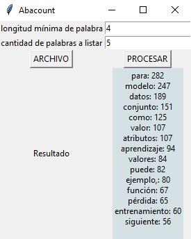

# Desktop application for Windows.

#Run the EXE file

#Select your pdf file

#Defines the following numerical values:
    Minimum length
    Number of words to list

#Click on "PROCESAR"

#The program will list and count the number of times words of the defined length are repeated.

Note: 

-This is an executable file on Windows

-The language is spanish because the client requested it.

-The client did not request it, that is why the program does not present any noticeable visual style.
